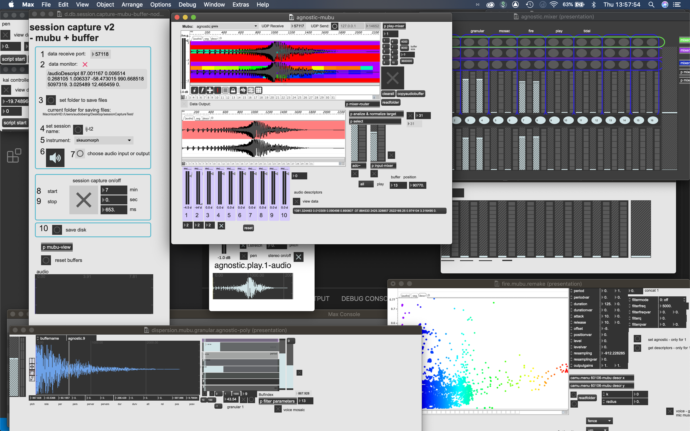

# Embodied Digital Instrumental Systems: performer-system perspectives
Welcome Doug and Kieran!!

## overview
0. Timeline
1. Instructions: Session Capture module (including instrument definer)
1. Instructions: Video + Screen capture
1. Questionnare link
1. Notes on documenting the 20-30 min performance session
1. Instructions for guided reflection
1. Submitting your files
1. Setting up an interview date/time
## 0.0 Timeline
For the prototype study - if it is possible to have your Questionnare (3.), documentation for the performance session (4.) and guided reflection (5.) by: 
-  Saturday April 24th evening or Sunday April 25th (early as possible), 

 such that I can review them as to make any necessary adjustments for the release of the study to the external performer participants on Monday April 26th that would be very helpful. Let me know if this is possible or not. 
## 1.0 Session Capture Module (with instrument definer)
The session capture module contains 2 separate submodules. The first in the `instrument definer` module that takes your control data sent over udp and creates the necessary information structure (held in a JSON file) that informs the second submodule `session capture` such that it has the necessary components to capture the control data from your performance system. 
### 1.1 required software and installation 
1. [max 8](https://cycling74.com/downloads) (link)
    - follow the link to download 
#### 1.1.1 Setting Up Max and the mubu package for max
1. In Max, navigate to "File->Show Package Manager"
	* in the Package Manager, search for "Mubu" and install the package
2. In Max, go to "Options->File Preferences"
	* Click the "+" in the lower left
	* Add the path ***main directory????*** 

- DEVELOPMENT NOTE: what other externals are needed if any? Git clone instructions, etc?
### 1.2 instrument definer
- the instrument definer is located in database folder of the dispersion lab git repo and is called 
`db.instrumentDefiner.maxpat`

#### 1.2.1 instrument definer instructions
-  [instrument definer](https://youtu.be/Jl0v9e7--aI) (link to video instructions) 
1. locate `db.instrumentDefiner.maxpat` in the database folder and open patch
1. verify that your control data is being sent to the correct UDP port (choose the port in the instrument definer patch)
1. if possible - be able to turn off continuous data
1. set instrument name
1. set author name
1. quick move through control parameters to get a min and max for each
1. if too much data is sent to the instrument definer it may not be able to handle it. 
1. it is best to send each collection of parameters individually 
1. check through dropdown menu and data windows that all relevant parameters are accounted for
1. save
1. now your instrument definition is read for session capture

### 1.3. session capture
- session capture is located in teh database folder of the dispersion lab git repo and is called:      
 `d.db.session.capture-mubu-buffer-node-v2.0.maxpat`
-  [session capture](https://youtu.be/MbhJ0SMNBpk) (lind to video instructions)
1. locate `d.db.session.capture-mubu-buffer-node-v2.0.maxpat` in the database folder and open patch
1. verify you are sending data to the right port
1. check data monitor to verify session capture is recieving data
1. choose folder where you will save files from session capture
1. enter session name - use your name with modifiers if necessary
1. choose your instrumemnet from the dropdown menu
1. choose input or output of max (send audio to max if necessary)
1. test by starting session capture - perform for a few seconds/minutes and then stop
1. save -- verify that an audio and json file have been saved in your folder choice
1. verify the data has been captured by opening the mubu viewer
	1. double click on the `p mubu-view` object
	1. double click on the `mubu session`
	1. we view the data in mubu which might take a couple seconds to open 
1. ***IMPORTANT*** do not have the mubu viewer open while recording it will significantly slow down the rate of data capture. Only open the mubu viewer after you have recorded and close before recording again. 

## 2.0 video documentation
1. screen capture: quicktime 

1. video recording from an angle that gets your iteraction contact points: for me it is my hands and head/mouth
<!--  -->

<!-- //  -->

1. once you have started both screen capture and video recording if you could clap your hands such that we have a sync point for the audio-video
	1. ***IMPORTANT NOTE***: If you are using headphones (vs speakers) for your system output (as I do) have the video recorder's audio record the room and the screen capture record the output of your system - and using a microphone that is output through your system - then clap such as to have the sync point. 

## 3.0 questionnare link
- please fill out [EDIS:performer-perspectives questionnare](https://docs.google.com/forms/d/e/1FAIpQLScneAqfCojfFYqSxHCCaCvpgi8sH7hSNNKe-HH4yK4Xe7Q1Gg/viewform) (link)
## 4.0 notes on documenting 20-30 min performance session
1. start your audio-video/screen capture for documentation
1. setup and start the session capture module ensuring data and audio are being sent to max
1. perform for 20-30 minutes (no longer than an hour as session capture will stop recording)
1. the approach to the performance is up to you – an improvisation, performing a composed piece, a rehearsal, study, etc.  
## 5.0 instructions for guided reflection

- Take about 5-10 mins to reflect on your performance (using the audio/video documentation) and select 1-3 sections, approximately 30secs - a few minutes in length, noting start and end times and briefly descripe why you chose this/these section(s).
	- For each, briefly describe how your actions reflect in the moment intentions at the level of interaction. Most likely this will relate to what your system does and how you control/guide/interact with it.
- In general - comment on what worked and didn’t work in terms of what you were attempting to do?
- please mention any other comments/thoughts that come to mind. 
- the guided reflection can be documented as a text, audio, or video file, whatever is most confortable for you. 
- the guided refelction will provide a starting point for the semi-structured interview

## 6.0 Submitting your files
- I am open to suggestions here. I have thought about github, dropbox, etc and have been leaning towards dropbox as it allows me to provide a file request such that you can send your compressed folder with all your files to my private dropbox account. 
- The limit for the (compressed folder) file that you can send is 100 GB. If your file goes over this (which they shouldn't) please export a compressed video file from quicktime to reduce the size (selecting 480p from the file/export as/480p will reduce the size by roughly 1/3 while providing a satisfactory resolution for our purposes) 
- [link to file request to send your compressed file to my dropbox (private)](https://www.dropbox.com/request/2bVKcjXAZqI9Ya2r8cR9)
## 7.0 Setting up an interview
- once you have submitted the performance session documentation, including the session capture module files (json and aif/audio files), and screen/video files, and the guided reflection, I will email you to set up an interview date and time. 