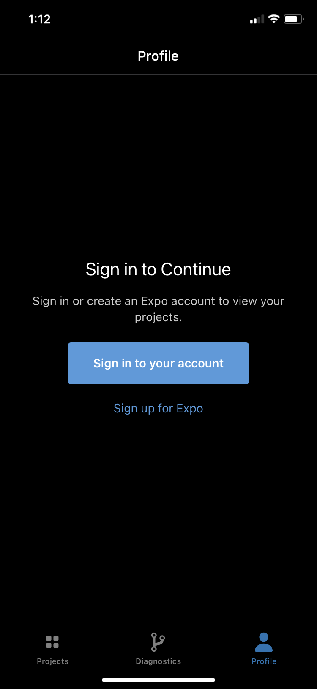
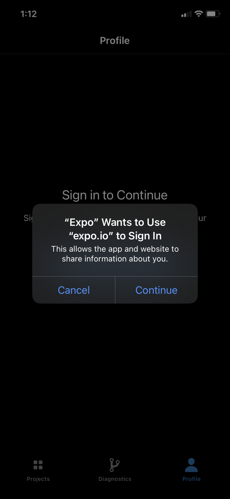
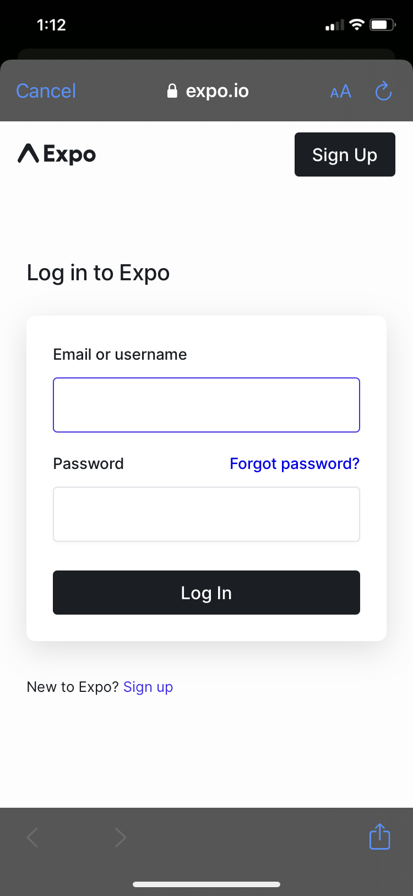
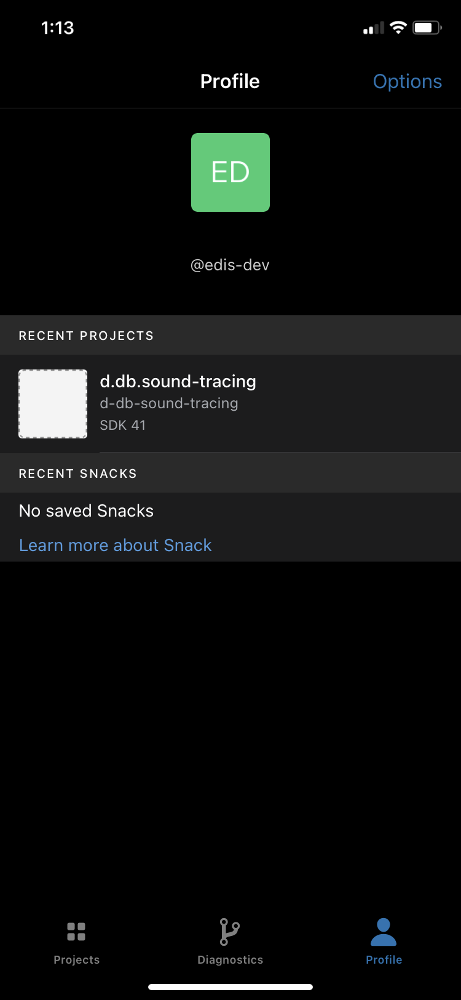
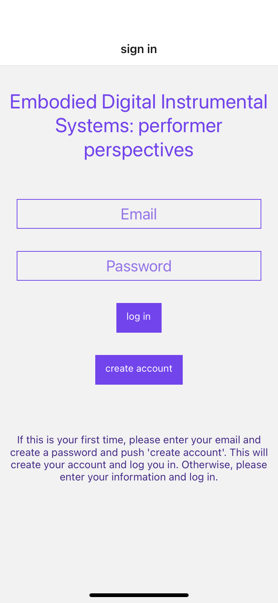
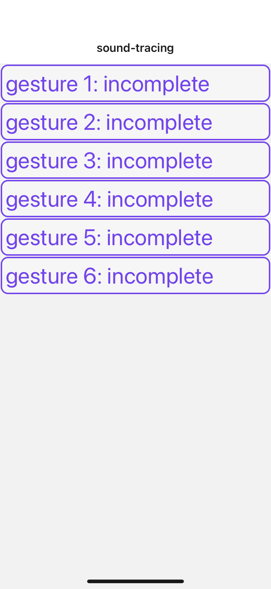

# PHASE II
# Embodied Digital Instrumental Systems: performer-system perspectives

Welcome to the information page for the study *EDIS: performer-system perspectives*. Currently we are in **Phase II** of the study. **Phase I** instructions have been moved [here](pages/phaseI.md) (link). The main outcomes are: 

1. recreation study
1. sound-tracing study

## 1. RECREATION STUDY
In this section of phase II, the audio from the video sections chosen during the interviews will be used as 'scores'. There are 6 audio clips in total. On average the clips are longer than expected. To accommodate this, and ensure that the recreation study does not take longer than planned, I will send an email to each of you indicating 4 audio clips to focus on and then if you have time, or would simply like to do all 6, please feel free to complete the remaining 2.

The audio is located in the `audio-clips` folder. From the main edis github page, simply click on the `audio-clips` folder, then click on an audio file, and then click download. 
     
    
     
     
There is not a specific strategy to approaching the recreation of the audio clip or a specific desired outcome. In some cases, creating a version with your system could be straight forward, and in others it will not be. The interesting aspect will be how the audio score is interpreted by you with your system. 

At the end of completing the recreation of each clip, please take 1-2 minutes or so to reflect on the process describing briefly the approach you took and the challenges/insights that you encountered. Feel free to document this reflection with text, video or audio.  

Plan to spend about 20 minutes with each audio clip. 

`IMPORTANT NOTE` 
When recording your performance of each clip, please use the same process you used for capturing your performance session as described in [phase I](pages/phaseI.md). Each audio clip recreation will be a mini version of the performance session. 
1. using the `session-capture` max patch for audio and control data (aif and json files)
2. using the video (and audio if relevant) setup. Remember to clap for syncing purposes.
3. brief reflection on the process 

### 1.1 SUBMITTING YOUR FILES
For each recreation please indicate in the file names which audio clip they refer to: 
1. session capture files: aif and json
2. 1 or 2 video files
3. your reflection text, video or audio file
4. just to note: there is no need to resend the `instrumentDefinitions.json` file

Put all of your files for all audio clips into a single folder: 

1. compress the folder and rename the new compressed file with your name
4. [link to file request to send your compressed file to my dropbox (private)](https://www.dropbox.com/request/2bVKcjXAZqI9Ya2r8cR9)

Please aim to complete phase II by Sunday May 23rd. 
## 2. Sound-tracing Study
This part of the study should not take long to complete, approximately 15-20 minutes not including installing the application. 

Please test the audio and data beforehand (more below), but do not rehearse or choreograph movements for the audio segments, simply move your mobile device as if you are performing the audio as you listen to the sound (after pressing `play audio + record control data` - more on this below). 

`Important notes:` Please start with your arm resting at your side with the phone facing inwards towards your leg. After you have completed all the sounds email me to let me know you are done and whether you used your right or left hand. Using a good set of headphones is preffered as you will hear the full spectrum of the audio, just be aware if this impedes your movement.  

### Overview
1. download `Expo Go` for your mobile device
1. Login to `Expo Go`
1. Login into the `d.db.sound-tracing` application. 
4. Gesture interface overview
1. Notes on conducting sound-tracing exercise and some know issues

### 1. Download/install Expo Go for your mobile device
[For Apple iOS click here](https://apps.apple.com/ca/app/expo-go/id982107779)

[For Android click here](https://play.google.com/store/apps/details?id=host.exp.exponent&hl=en_CA&gl=US)

Or search in the relevant app store: `Expo go`

### 2. Login to Expo Go
I have created an expo account for this study. Once you have downloaded and installed the `Expo go` application follow the following process to sign into the Expo account for this study. 

 

 
 

In image 1 choose `sign in to your account`. Choose `continue` for the screen shown in image 2. For image 3, use the following email and password to log in: 

email: edisstudy@gmail.com

password: sound-tracing

Once you sign in you should see the following page or one similar to it: 

 

 
 

You will notice three icons along the bottom with the names projects, diagnostics, and profile. If you are not already on profile choose it now as this is where we will find the sound-tracing application. There will be only one application. Choose the `d.db.sound-tracing` application which will open and present you with the following window (below). It may take a few seconds to load. 
### 3. Create an account in the d.db.sound-tracing application

 

 
 

Use your email that we have been communicating with and `choose a password` and then press `Create Account`, which will create your account and log you in. Remember this password (and email) incase you get logged out. 

### 4. choose Gesture and interface overview
Once you are logged in you will see the following INDEX screen
 

 
 
This screen shows the 6 gestures to complete. Choose them in any order and complete them at your leisure. There is no need to finish them all at once as when you reopen the app, you will remain logged in (for your device) and the gestures you have completed will be indicated. 

Choose one of the gestures, the image below is of gesture 1: 
 

 
 
There are 8 buttons and 1 slider in total: 

`home` in the top left corner will return you to the gesture INDEX page

TEST and SETUP BUTTONS

`test data:` will turn on and off the sensors that will be captured. It is a good idea to test this before you start to ensure that everything is working as it should. You should see the numbers for each parameter update quickly if this is turned on. 

`audio countdown:` provides a three second lead in to the audio segment. It is up to you if you would like this on. 

`play audio` will simply play the audio so that you can listen to it beforehand if you wish. 

`pause audio` stop the audio in place. Press it again to continue where you left off. 

`stop audio` will stop the audio and return it to the beginning. You must press `play audio` for it to start again. 

`volume` change the volume as you feel fit. The audio will change once you have stopped moving the slider. 

MAIN BUTTONS 

`play audio + record control data` This button is the main one for playing the audio and capturing the data. You will notice when you press this button that the data will automatically turn on and the audio will play. Thus, you do not need to turn on the data as this will happen when you press this button. If the `audio countdown` is turned on it will play before playing the audio segment and turning on the data. Once the audio segment has completed the data will automatically turn off. 

`send to database`: After the audio has completed and the data has been turned off after pressing `play audio + record control data`, press this button to send the data to the database. This may take a few seconds. You will see the following screen with an alert if the data has been successfully send to the database. 

 

 
 

When this alert comes up you know the data has been sent to the database, you can press OK and then press the home button in the top left corner which will return you to the INDEX screen that will show the completed gestures. In the following images, gesture 1 and 6 have been completed. 

 

 
 

### 5. notes on conducting sound-tracing exercise and some known issues. 
For the sound-tracing exercise there is no expectation that you plan any movement ahead of time. The play, pause, stop, and test data buttons are simply available to test the playback and the sensors. 

The exercise consists of listening to each audio segment and moving the mobile device `as if you were performing the audio`. This is not about choreographing movements to each sound but simply reacting to the sound - moving the mobile device as if you were performing while you are listening to the sound. So do test the data and playback beforehand such as to address any issues, but this exercise should not take very long to complete. 15-20 minutes total should be fine depending on the issues that arise (see below); and, it does not need to be completed all at once. 

Feel free to use headphones, though be aware of how the cord inhibits movement. 

This is a beta testing for this application so there may be issues that arise that are unforeseen. 
Known issues include: 

1. Having the cursor for the audio lag behind the playing of the audio. If this occurs please try again. If it persists, please keep note and let me know which ones this occured with. I have found if this happens, it does not happen again on the second try. 
2. After pressing the `send to database` button the alert does not show up that it was successful. Allow 30 seconds for this to show up, though I have found that it usually occurs in 3-5 seconds. If it does not show up after roughly 30 seconds, try closing the application and try recording again and sending to the database. If this happens again, make note of which gesture this occured for and move on. 
3. Shaking the app will bring up a menu, shown in the image below. If this occurs while you are capturing your gesture simply ignore the screen untill the audio has stopped and the data is turned off. It will not effect capturing the data. Simply press the `x` in the top right corner of the menu to close.  
  

 
 