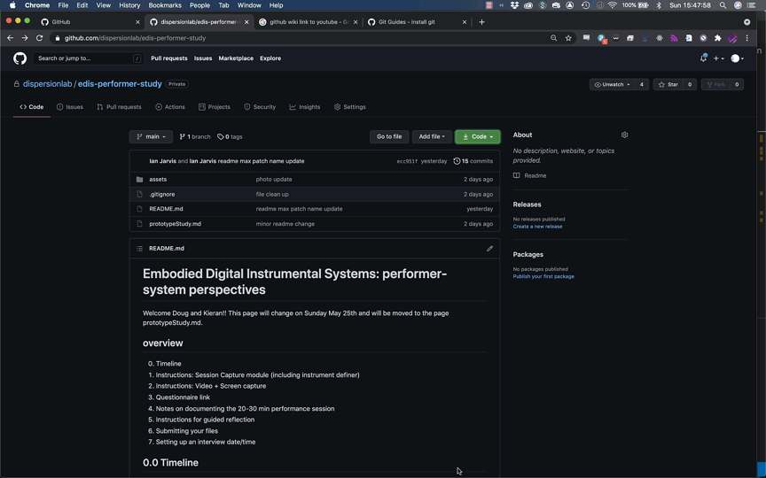

# PHASE I
# Embodied Digital Instrumental Systems: performer-system perspectives
Welcome to the information page for the study *EDIS: performer-system perspectives*. Currently we are in **Phase 1** of the study. The main outcomes are: 

1. complete the questionnaire
1. document a 20-30 minutes performance (informed by tutorials)
1. complete a guided reflection
1. setup an interview date & time. 

There are some aids to help this process go smoothly including:  
1. tutorials/instructions for: 
    1. the session capture module for capturing control data and audio output of your performance session
    1. video documenting your performance session 
1. process for submitting your files as a compressed folder

## overview
0. Timeline
1. Instructions: Session Capture module (including instrument definer)
1. Instructions: Video + Screen capture
1. Questionnaire link
1. Notes on documenting the 20-30 min performance session
1. Instructions for guided reflection
1. Submitting your files
1. Setting up an interview date/time

## 0.0 Timeline
For Phase I of the study - please aim to have the main outcomes completed by Thursday April 29th or Friday April 30th, such that we can schedule interviews for early the following week (Week of May 3rd) as it is important to have the interviews completed before we can start [Phase II](phaseII.md). If there is an issue please let me know so that we can adjust accordingly - life happens and I would like this experience to be as stress free as possible for you. 
## 1.0 Session Capture Module
The session capture module contains 2 separate submodules: 
- the first is the `instrument definer` module that recieves your control data sent over udp and creates the necessary information structure (held in a JSON file) that informs 
- the second submodule `session capture` with the necessary components to capture the control data from your performance system. 

In order for `session capture` to function appropriately we need to ensure: 
1. we have the necessary software instralled: maxMSP, MUBU max package, and the phase I study related software.  
1. we can send control data from our digital instrumental system to maxMSP for using the `instrument definer`
1. we can also send audio from our digital instrumental system to maxMSP for using `session capture`

### 1.1 required software and installation 
1. [max 8](https://cycling74.com/downloads) (link)
    - follow the link to download 
    - if you do not own max - you will be able to use it free for one month. 
    - if you have already used the free trial period you are still able to run the software for this study - you just will not be able to save any changes made to max patches (which is not part of this study - so we should not be effected by this).
1. Add the MUBU max package: 
    - In Max, navigate to `File/Show Package Manager`
        * in the Package Manager, search for `Mubu` and install the package
1. Download/clone the dispersion lab software from this github repository
    - navigate to the `green code button` near the top of this page, click on it, and select download. A compressed file will be downloaded to your downloads folder. Move this folder to the directory you would like it to be. 
     
    <!--  -->
    - for those with git installed you can also clone the repo.
1. In Max, go to "Options->File Preferences"
    * Click the "+" in the lower left
	* Add the path of the main directory that you cloned from the study github repository 
1. Video for setting up max and MUBU ???

### 1.2 instrument definer
- the instrument definer is located the top level of the EDIS-PHI??? repository you cloned/downloaded. The file is named: `db.instrumentDefiner.maxpat`

#### 1.2.1 sending your control data to max
- send your control data in OSC format over UDP
- please contact me as soon as possile if you are experiencing issues sending control data from your instrumental system OR you have issues with `instrument definer` (below) recognizing the data you are sending, such that I can help work out a solution. ??? check emails for responses to this

#### 1.2.2 instrument definer instructions
-  [OLD LINK: instrument definer](https://youtu.be/Jl0v9e7--aI) (link to video instructions) ???
1. locate `db.instrumentDefiner.maxpat` in the EDIS-PHI??? folder and open the patch. 
1. verify that your control data is being sent to the correct UDP port (choose the port in the instrument definer patch)
1. set the instrument name: this will be the name you choose from `session capture`
1. set author name ???
1. move through control parameters to get a min and max for each ???
1. depending on the amount of data you are sending at one time, `instrument definer` may slow down. If this is continually an issue, if possible, reduce the amount of data you are sending at one time - see video above. If this remains an issue please contact me such that we can work out a solution.  
1. if possible, it is best to send each collection of parameters individually 
1. check through the dropdown menu and data windows that all relevant parameters are accounted for
1. save
1. now your instrument definition is ready for session capture

### 1.3 session capture
- session capture is located in the database folder of the dispersion lab git repo and is called: `d.db.session.capture-mubu-buffer-v2.0.maxpat`
#### 1.3.1 sending audio (and control data) to session capture
1. if you were able to send control data to `instrument definer` - then you are able to send it to `session capture`
1. If maxMSP is not the software you are using to render the audio output of your performance, you will need to route your audio to maxMSP. 
    - for PC users: 
        - [Voicemeeter](https://vb-audio.com/Voicemeeter/)
            - [tutorial](https://www.youtube.com/watch?v=lpvae_2WOSQ) (start at 4:30 - it is not for max but the setup should be the same) Please let me know if this is not the case. 
    - for max users: 
        - [Blackhole](https://existential.audio/blackhole/)
        - [Loopback](https://rogueamoeba.com/loopback/)

#### 1.3.2 session capture instructions
-  [session capture](https://youtu.be/MbhJ0SMNBpk) (link to video instructions) ???
1. locate `d.db.session.capture-mubu-buffer-v2.0.maxpat` in the EDIS-PHI??? folder and open patch
1. verify you are sending data to the right port number
1. check data monitor to verify session capture is receiving data
1. choose folder where you will save files from session capture
1. enter session name - use your name with modifiers if necessary
1. choose your instrument from the dropdown menu
1. choose input or output of max 
    1. make sure you are sending audio to max if necessary. 
1. test by starting session capture - perform for a few seconds/minutes and then stop
1. save -- verify that an audio and json file have been saved in your folder choice
1. verify the data has been captured by opening the mubu viewer
    1. double click on the `p mubu-view` object
    1. double click on the `mubu session`
    1. verify the data in mubu which might take a couple seconds to open 
1. ***`IMPORTANT`*** do not have the mubu viewer open while recording it will significantly slow down the rate of data capture. Only open the mubu viewer after you have recorded and close before recording again. ??? gif of closing 

## 2.0 video documentation
1. screen capture: QuickTime 

    - NOTE ??? : it is a known issue that depending on your setup, the interfaces you use, the CPU of your computer, etc. that adding screen capture may inhibit the ability to perform your system and/or capture data. If this is the case, if it is possible to set up two phones/tablets/camaras, one capturing your screen, the other your relevant movements, than please attempt that option. If there is only one video camara available, if it is possible to capture your movements and screen, than attempt that option. If neigher of these are possible, do not screen capture. Simply take a screen shot (image) of your screen based setup and just do the video recording. 
2. video recording from an angle that gets your interaction contact points: for me it is my hands and head/mouth
<!--  -->

<!-- //  -->

3. once you have started both screen capture and video recording if you could clap your hands such that we have a sync point for the audio-video
    1. ***IMPORTANT NOTE***: If you are using headphones (vs speakers) for your system output (as I do) have the video recorder's audio record the room and the screen capture record the output of your system - and using a microphone that is output through your system - then clap such as to have the sync point. 

## 3.0 questionnaire link
- please fill out [EDIS:performer-perspectives questionnare](https://docs.google.com/forms/d/e/1FAIpQLScneAqfCojfFYqSxHCCaCvpgi8sH7hSNNKe-HH4yK4Xe7Q1Gg/viewform) (link)
## 4.0 notes on documenting 20-30 min performance session
1. start your audio-video/screen capture for documentation
1. setup and start the session capture module ensuring data and audio (if necessary) are being sent to max
1. perform for 20-30 minutes (no longer than an hour as session capture will stop recording)
1. the approach to the performance is up to you – an improvisation, performing a composed piece, a rehearsal, study, etc.  
## 5.0 instructions for guided reflection

- Take about 5-10 mins to reflect on your performance (using the audio/video documentation) and select 1-3 sections, approximately 30secs - a few minutes in length, noting start and end times and briefly describe why you chose this/these section(s).
    - For each, briefly describe how your actions reflect in the moment intentions at the level of interaction. Most likely this will relate to what your system does and how you control/guide/interact with it.
- In general - comment on what worked and didn’t work in terms of what you were attempting to do?
- please mention any other comments/thoughts that come to mind. 
- the guided reflection can be documented as a text, audio, or video file, whatever is most comfortable for you. 
- the guided reflection will provide a starting point for the semi-structured interview

## 6.0 Submitting your files
1. put all of your files into a single folder: 
	- session capture JSON and AIF files
	- the video file(s) from the performance session documentation
	- guided reflection text, audio, or video file. 
1. compress the folder and rename the new compressed file with your name
1. The limit for the (compressed folder) file that you can send is 100 GB. If your file goes over this (which it shouldn't) please export a compressed video file from QuickTime to reduce the overall size (selecting 480p from the file/export as/480p will reduce the size by roughly 1/3 while providing a satisfactory resolution for our purposes) 
4. [link to file request to send your compressed file to my dropbox (private)](https://www.dropbox.com/request/2bVKcjXAZqI9Ya2r8cR9)
## 7.0 Setting up an interview
- once you have submitted your files, I will email you to set up a date/time for the interview. 

