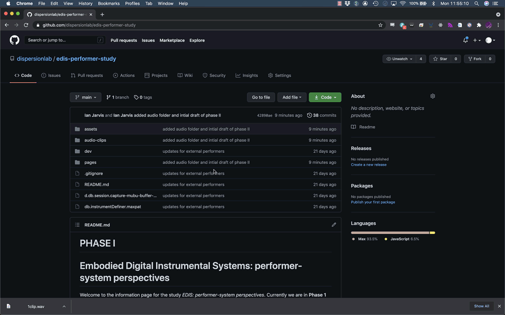

# PHASE II
# Embodied Digital Instrumental Systems: performer-system perspectives

Welcome to the information page for the study *EDIS: performer-system perspectives*. Currently we are in **Phase II** of the study. **Phase I** instructions have been moved [here](pages/phaseI.md) (link). The main outcomes are: 

1. recreation study
1. sound-tracing study

## 1. RECREATION STUDY
In this section of phase II, the audio from the video sections chosen during the interviews will be used as 'scores'. There are 6 audio clips in total. On average the clips are longer than expected. To accommodate this, and ensure that the recreation study does not take longer than planned, I will send an email to each of you indicating 4 audio clips to focus on and then if you have time, or would simply like to do all 6, please feel free to complete the remaining 2.

The audio is located in the `audio-clips` folder. From the main edis github page, simply click on the `audio-clips` folder, then click on an audio file, and then click download. 
     
    
     
     
There is not a specific strategy to approaching the recreation of the audio clip or a specific desired outcome. In some cases, creating a version with your system could be straight forward, and in others it will not be. The interesting aspect will be how the audio score is interpreted by you with your system. 

At the end of completing the recreation of each clip, please take 1-2 minutes or so to reflect on the process describing briefly the approach you took and the challenges/insights that you encountered. Feel free to document this reflection with text, video or audio.  

Plan to spend about 20 minutes with each audio clip. 

`IMPORTANT NOTE` 
When recording your performance of each clip, please use the same process you used for capturing your performance session as described in [phase I](pages/phaseI.md). Each audio clip recreation will be a mini version of the performance session. 
1. using the `session-capture` max patch for audio and control data (aif and json files)
2. using the video (and audio if relevant) setup. Remember to clap for syncing purposes.
3. brief reflection on the process 

### 1.1 SUBMITTING YOUR FILES
For each recreation please indicate in the file names which audio clip they refer to: 
1. session capture files: aif and json
2. 1 or 2 video files
3. your reflection text, video or audio file
4. just to note: there is no need to resend the `instrumentDefinitions.json` file

Put all of your files for all audio clips into a single folder: 

1. compress the folder and rename the new compressed file with your name
4. [link to file request to send your compressed file to my dropbox (private)](https://www.dropbox.com/request/2bVKcjXAZqI9Ya2r8cR9)

## 2. Sound-tracing Study
Will be updated shortly